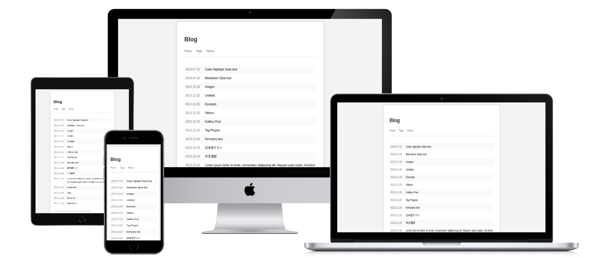

### Live Preview



* [Demo Preview](https://maodaisuki.github.io/hexo-theme-maoblog)

### Deploy by github pages

1. Fork the repository.

```
$ git clone maodaisuki/hexo-theme-maoblog
```

2. You can delete the branches called theme and master if you want.

The site powered by the branches called main and gh-pages.

3. Modify the config.yml & config.maoblog. in main branch.

* config.yml

```
url:
```

Fill in your own url. And you can set the author and so on. Please see the [docs](https://hexo.io/docs/configuration).

* config.maoblog.yml

```
copyright:
    name: [your name]

utterances:
    enable: true
    repo: [your repo]
    issueTerm: pathname
    theme: github-light 
```

You also can set the `utterances.enable: false` to turn off the comment. More info see [utterances](https://utteranc.es/).

Then push the repo and the github action should be worked. Now see your site in `https://username.github.io/reponame`.

### Thanks

Referenced [one-paper](https://github.com/zheli-design/hexo-theme-one-paper) and [delicate](https://github.com/can-dy-jack/hexo-theme-delicate) and other projects.